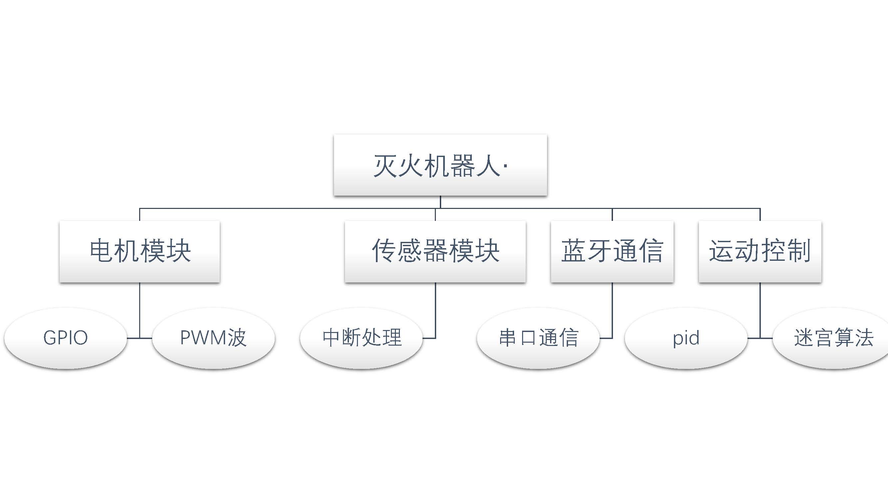

# stm32-learning-notebook

该资料库存放一些关于基于stm32单片机的灭火机器人的学习资料

## 简明教程

- 第一次
  - [安装集成开发环境 MDK5](./简明教程/第一周/MDK5简介及安装介绍.md)
  - [新建基于固件库的MDK5工程模板](./简明教程/第一周/基于固件库的工程模板建立/新建工程模板.md)
- 第二次
  - [跑马灯](./简明教程/第二周/跑马灯.md)
- 第三次
  - [组织跑马灯代码](./简明教程/第三周/组织跑马灯代码.md)
- 第四次
  - [stm32中断讲解](./简明教程/第四次/定时器中断.md)
- 第五次
  - [串口通信讲解](./第六次/串行通信基本原理.md)
- 第六次
  - [传感器部分讲解]
- 第七次
  - [算法部分讲解]
- 第八次
  - [进宫调试]
