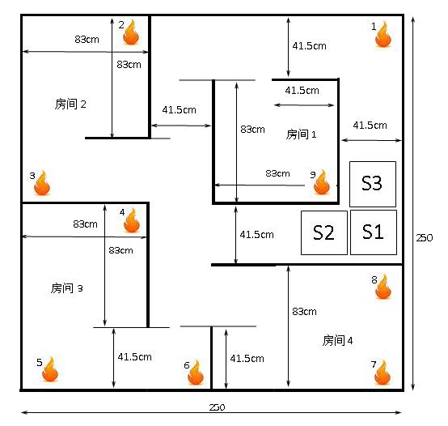

# Fire Fighting Robot

本项目是关于中国教育机器人大赛（ERCC）灭火与救援组的代码。比赛分为两个部分，分别是灭火与搜救部分。

## 1. 机器人任务

一个由 STM32 控制的自主灭火机器人和一个由 Openduino 控制器控制的救援机器人，在一间模拟平面结构的房间里运动，找到代表房间里的火灾点（正在燃烧的蜡烛）并尽快将它扑灭，待所有火焰扑灭后由救援机器人在场地内运动搜索需要救援的目标物品（用搬运比赛的色块代替），并将物品救出并回到出发点。

## 2. 机器人设计

为了更好的性能，我们对轮式机器人的结构进行改进。

- 关于机器人的电控方案，请查看`/Source Code/Readme.md`。
- 关于机器人的源代码，请查看`/Source Code/Code/`

