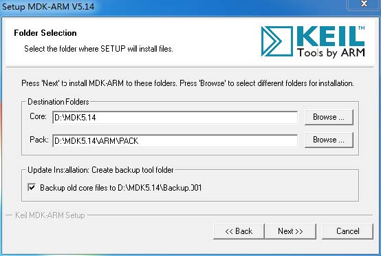
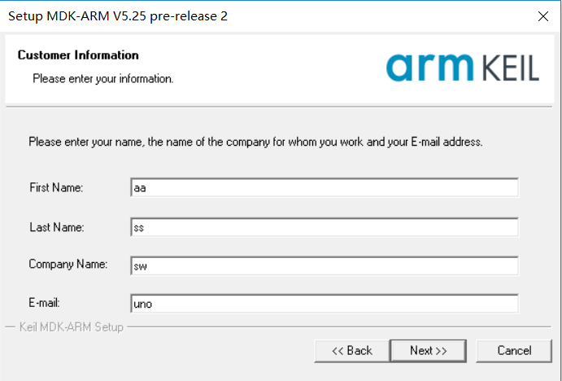
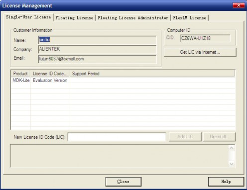
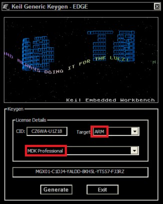
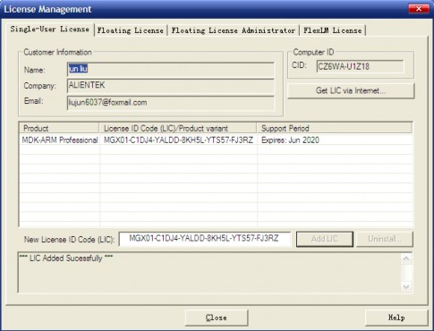

# MDK5 简介及安装

## 1. MDK 5简介

MDK 源自德国的 KEIL 公司，是 RealView MDK 的简称。在全球 MDK 被超过 10 万的嵌入式开发工程师使用。本项目采用的是：MDK5.14，该版本使用 uVision5 IDE 集成开发环境，是目前针对 ARM 处理器，尤其是 Cortex M 内核处理器的最佳开发工具。

### 1.1 MDK5 兼容性

MDK5 向后兼容 MDK4 和 MDK3 等，以前的项目同样可以在 MDK5 上进行开发(但是头文件方面得全部自己添加!!!)， MDK5 同时加强了针对 Cortex-M 微控制器开发的支持，并且对传统的开发模式和界面进行升级。

### 1.2 MDK5 组成

MDK5 由两个部分组成：MDK Core 和 Software Packs。其中， Software Packs 可以独立于工具链进行新芯片支持和中间库的升级。
MDK Core 分成四个部分：

- uVision IDE with Editor（编辑器）
- ARM C/C++ Compiler（编译器）
- Pack Installer（包安装器）
- uVision Debugger with Trace（调试跟踪器）。

uVision IDE 从 MDK4.7 版本开始就加入了代码提示功能和语法动态检测等实用功能，相对于以往的 IDE 改进很大。

MDK5 中，MDK Core 是一个独立的安装包，它并不包含器件支持和设备驱动等组件，但是一般都会包括 CMSIS 组件，大小 350M 左右，相对于 MDK4.70A 的 500 多 M，瘦身不少，MDK5 安装包可以在：[keil 官网] 下载到。而器件支持、设备驱动、CMSIS 等组件，则可以点击 MDK5 的 Build Toolbar 的最后一个图标调出 Pack Installer，来进行各种组件的安装。也可以在 <http://www.keil.com/dd2/pack>  这个地址下载，然后进行安装。

在 MDK5 安装完成后，要让 MDK5 支持 STM32F103 的开发，我们还需要安装 STM32F1的器件支持包：Keil.STM32F1xx_DFP.1.0.5.pack（STM32F1 的器件包）。

引自<www.openedv.com>

## 2. MDK5 安装

打开 mdk514.exe,进行安装。MDK安装比较简单，基本只要一路按 next 即可。

### 2.1 安装路径

**安装路径最好直接是D盘**，新建MDK5.14文件夹下。如下图所示。

### 2.2 设置信息

安装 MDK5 时会让你填写一些简单的信息，这些信息无关紧要，随便设置即可，如下图。

>注意！**安装路径不要包含中文名字！**

### 2.3 Tools by ARM

安装软件可能会提示安装总线控制器，选择**安装**即可

### 2.4 Pack Installer

安装完成之后，点击 Finish, 之后，MDK 会自动弹出 Pack Installer 界面。

从上图可以看出，安装MDK5.14后，CMSIS和MDK中间软件包已经安装了。另外，程序会自动去 KEIL的官网下载各种支持包，不过这个过程有可能失败。可以直接确定，关闭这个包安装器。我们可以自行去官网下载支持包。下载地址：<http://www.keil.com/dd2/pack>

#### 2.4.1 STM32F103支持包安装

这里我们以：STM32F103开发为例，则至少需要安装CMSIS 和STM32F103的器件支持包。CMSIS包MDK5.14 自带了，所以不需要单独再安装。所以只需要再安装STM32F103的器件支持包即可。

支持包文件名为： Keil.STM32F1xx_DFP.1.0.5.pack，我们双击光盘的这个安装包，即可完成 MDK5.14 的安装（此时仅支持STM32F103的开发，其他MCU请自行在官网下载对应的器件支持包）。

[keil 官网]: <http://www.keil.com/demo/eval/arm.htm> "http://www.keil.com/demo/eval/arm.htm"

## 3. MDK5.14 破解

**(破解仅供学习使用，严禁商业用途，如需用于商业用途，请购买正版软件！)**

双击左面的图标（注意，如果直接双击无法注册，**请右键以管理员身份运行MDK5**，之后再注册），如图所示：

然后，点击：File>License Management，调出注册管理界面，如图所示

图 2.2 MDK5 注册界面

从上图可以看出，此时是评估版，使用上面是有限制的，不能编译超过32K的代码，需要输入注册码以后才可以正常使用。

接下来，我们看看如何注册。首先，运行keygen.exe（要先解压)，在keygen.exe 里面，设置Target为ARM，然后拷贝 MDK License Management 界面里面的 CID 号，到 keygen.exe里面CID栏，点击：Generate，即可获得注册码.

图 2.3 获取注册码

之后，拷贝注册码到 License Management 里面，点击 Add LIC 即可完成注册，如图 2.4

所示：

图 2.4 MDK5.14 完成注册

从图中可以看到，我们破解后 MDK 可以用到 2020 年了。
