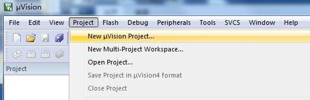
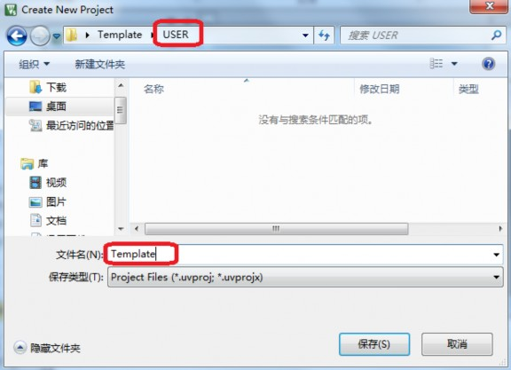

# 新建工程模板

在这里我们介绍一下基于[固件库]的工程模板的建立。初学者搭建开发环境建立工程模版大约需要2-3个小时，(但我觉得大家不用这么久^ - ^)，请耐心按照手册的讲解来。

## 1. 环境搭建

### 1.1 获取官方固件库包

在这里，我们使用的是V3.5版本的固件库包`STM32F10x_StdPeriph_Lib_V3.5.0`，这是 ST 官网下载的固件库完整版，大家如果有下载资料包的话，资料应该在`STM32参考资料\STM32F1xx固件库\STM32F10x_StdPeriph_Lib_V3.5.0`。
如果没有的话，该教程文件夹中有提供该[固件库包]。也可在ST官网上下载最新的固件库包，或者在开发板厂商的[论坛]上下载。

### 1.2 集成开发环境

本教程使用的集成开发环境为MDK5，如果还没安装，请参考[MDK5简介及安装介绍]。

### 1.3 项目文件夹建立

建议大家在电脑的某个目录下面建立一个文件夹，后面所建立的工程都可以放在这个文件夹下面，这里我们建立一个文件夹为 `Template`。

## 2. 建立工程模板

### 2.1 新建工程

点击 MDK 的菜单：`Project –>New Uvision Project` ，然后将目录定位到刚才建立的文件夹`Template`之下，在这个目录下面建立子文件夹`USER`(我们约定将代码工程文件放在 `USER`目录下，根据个人喜好也可以放在其他文件夹下),然后定位到`USER`目录下面，我们的工程文件就都保存到`USER`文件夹下面。**工程命名**为`Template`,点击保存。

当前文件夹目录结构
>Template
>>USER
>>>Template.uvproj(工程文件)

### 2.2 芯片选型

接下来会出现一个选择 CPU 的界面，就是选择我们的芯片型号。因为我们使用的开发板`ALIENTEK miniSTM32F103` 所使用的 STM32 型号为 `STM32F103RTC6`，所以在这里我们选择`STMicroelectronics>STM32F1 Series>STM32F103>STM32F103RCT6`（如果使用的是其他系列的芯片，选择相应的型号就可以了，特别注意：一定要安装对应的器件 pack 才会显示这些内容哦！！如果没得选择，请关闭 MDK，然后安装对应的[支持包]。

[固件库]: <./固件库介绍.md>
[论坛]: <http://openedv.com/posts/list/6054.htm>
[固件库包]: <./STM32F10x_StdPeriph_Lib_V3.5.0.rar>
[MDK5简介及安装介绍]: <../MDK5简介及安装介绍.md>
[支持包]: <../MDK5简介及安装介绍.md#241-stm32f103支持包安装>